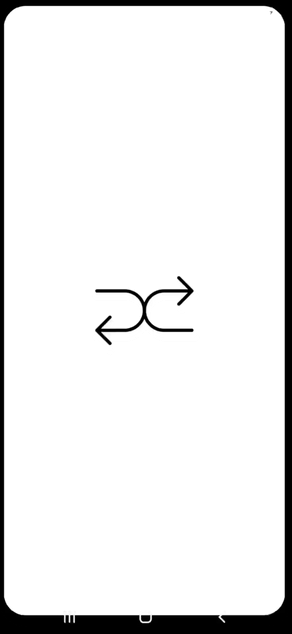
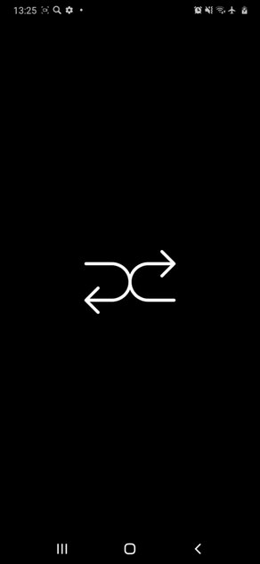

# RandomUser

Android application that loads information from the [Random User Api](https://randomuser.me)

## Technologies:

* Clean Architecture
* SOLID, KISS, DRY
* JUnit
* Retrofit
* Room
* MVVM
* LiveData
* Dagger
* Coil
* Navigation Component
* Night mode
* KSP

## Usage:

<table align="center">
  <tr  align="center">
    <td>Light mode</td>   
  </tr>
  <tr align="center">
    <td></td>
  </tr>
 </table>
 <table align="center">
  <tr  align="center">
    <td>Dark mode</td>
  </tr>
  <tr align="center">
    <td></td>
  </tr>
 </table>
